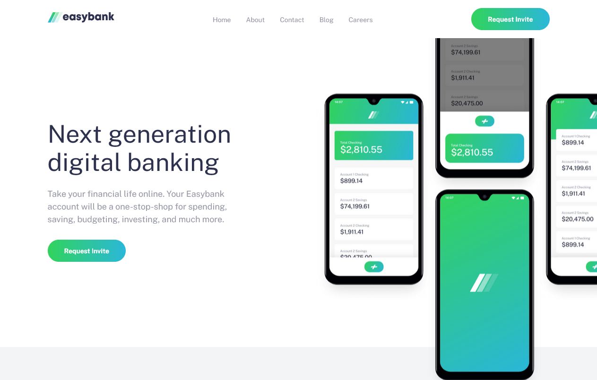

 <h1>Easybank landing page</h1>
 <h3>
    <a href="https://mohamedaridah.github.io/frontendmentor_easybank-landing-page/" title="Check The Website Live on Github" target="_blank">
      Live
    </a>
    &nbsp;|&nbsp;
    <a href="https://www.frontendmentor.io/solutions/easybank-landing-page-RY7S7zssL" title="Check My Solution on Frontend Mentor" target="_blank">
      Solution
    </a>
    &nbsp;|&nbsp;
    <a href="https://www.frontendmentor.io/challenges/easybank-landing-page-WaUhkoDN" title="Original Frontend Mentor Challenge Link" target="_blank">
      Challenge
    </a>
  </h3>
  

     Source of the project from <a href="https://www.frontendmentor.io/" target="_blank">frontendmentor.io</a>.
  

  <h5>
    

      
      
      
      &nbsp;
    

  </h5>

 
 

## Table of content:

1. [About the project](#about-the-project)
1. [Built with](#built-with)
1. [What I learned](#what-i-learned)
1. [What I Want](#what-i-want...?!)
1. [Useful resources](#useful-resources)
1. [Acknowledgments](#acknowledgments)
1. [Follow me](#follow-me)
    
    

## About the project

This is my <strong>3rd</strong> Frontend Mentor challenge.

This is my solution to the Easybank landing page challenge on Frontend Mentor. The goal of this challenge is to build out a landing page and get it looking as close to the [design](./design/desktop-preview.jpg) as possible.

Your users should be able to:

- View the optimal layout for the site depending on their device's screen size
- See hover states for all interactive elements on the page

## Built with

For this project i used:

- Semantic HTML5 markup
- Sass (CSS Pre-Processor)
  - Custom properties
  - Flexbox
  - CSS Grid
- Mobile-first workflow

## What i learned

In this project it was the first time for to to use Mobile First concept. And it was really helpfull to make website responsive in an easy way. The hard thing about this project was the responsiveness of the images specially `.hero` section images.

## What i want...?!

I need your opinions, feedbacks , how do you find my code structure? or any suggestions i can do to make my projects better. Also if you guys like my content, follow me this makes me happy❤👍.

## Useful resources

- [Coder Coder](https://www.youtube.com/c/TheCoderCoder) - her playlist on youtube helped me alot. Thanks Coder Coder!
- **Adobe Xd** - I use adobe xd to check the size of elements.

## Acknowledgments

- I want to say **Thanks** to anyone who see my work and react with it, give me his feedback and helped me to improve myself. So thank you❤.
- I want to **Thank** [catherineisonlin](https://github.com/catherineisonline) for inspiring me to write better `ReadMe` files. I learned many things from her. So thank you❤.
- I do not have access to the Figma or Sketch files so the design is not pixel perfect.

## Follow me

- My website - Well I haven't made my portfolio yet, but gonna make it soon.
-  &nbsp;Github - [@FedLover](https://github.com/MohamedAridah)
-  &nbsp;Codepen - [@FedLover](https://codepen.io/FedLover)
-  &nbsp;Frontend Mentor - [@mo](https://www.frontendmentor.io/profile/MohamedAridah)

**See you in another project!** 👋👩‍💻
